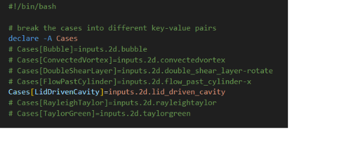
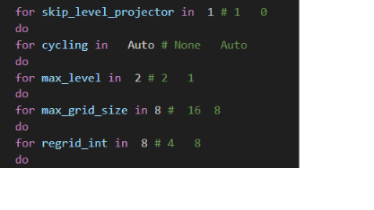
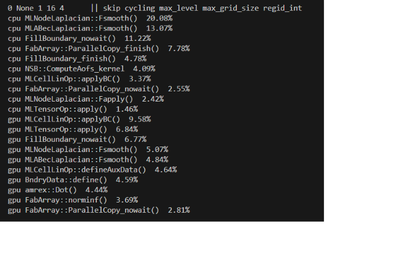

# IAMR Tutorial Profiling Results
Here are **tesing cases, data results and data analysis scripts** for investigating the efficiency of incompressible flow simulations on CPUs and GPUs with BSAMR.

[IAMR](https://github.com/AMReX-Fluids/IAMR) is a structured mesh adaptive mesh refinement solver based on amrex, which supports our research on AMR. Although IAMR supports cpu and gpu computation, it is not clear how some parameters of AMR affect the efficiency of cpu/gpu computation in simulation.

So we did the parametric studies to investigate the computational efficiency of incompressible flows on a block-structured adaptive mesh. The parameters include refining block size, refining frequency, maximum level, and cycling method. We provide our experimental data here, and hope that the conclusions obtained can provide guidance for simulation work, if you have more ideas in this regard, please feel free to communicate with us!


## How to do this
Firstly, you need to have AMREX，AMREX-Hydro, IAMR，we recommend you use following git repository.

```bash
git clone https://github.com/ruohai0925/amrex
git clone https://github.com/ruohai0925/AMReX-Hydro
git clone https://github.com/ruohai0925/IAMR/tree/development
```

You can compile and run it manually. 

```bash
cd IAMR/Tutorials_profiling/Bubble
git checkout development
cd IAMR/Tutorials_profiling/Bubble
make -j12 
./amr2d.gnu.PROF.MPI.ex inputs.2d.bubble
```
On this step, if you want to select cpu or gpu as your calcutlation  platform you need to manually modify the makefile and compile; to modify the parameters, please manually modify the input and run it.  

For makefile:
* cpu: omp = TRUE, mpi = TRUE, CUDA = FALSE
* gpu: omp = FALSE, mpi = FALSE, CUDA = TRUE
* dim: 

For input:
* kl


Or you can also use our scripts to compile, run, and get the results in one click!

```bash
cd IAMR/Tutorials_profiling
git checkout development
./jobiamr2dcpu
```
 
For these four automatic scripts, the only thing you need to do is to select the case and choose the parameter combination, which are inside of script.




Finally, the case reults are got and showed below.
## Case results
We conduct extensive tests on different CPUs/GPUs for various 2D/3D incompressible flow cases, including bubble, ConvectedVortex,DoubleShearLayer, etc. LidDrivenCavity1 is runing on the cpu (AMD Ryzen 5500) and gpu (v100), and others are getting from cpu (AMD Ryzen 9 7845HX) and gpu (RTX 4060). 

For every case, it has file structure like this:
```bash
Bubble
├── case_results_cpu2d
│   ├── cpu2d_skip0_Auto_mgs16_1_regrid4
│   │   ├── inputs.2d.lid_driven_cavity
│   │   └── log.txt
│   ├── cpu2d_skip0_Auto_mgs16_1_regrid8
│   │   ├── inputs.2d.lid_driven_cavity
│   │   └── log.txt
│   ├── cpu2d_skip0_Auto_mgs16_2_regrid4
│   │   ...
├── case_results_gpu2
│   │   ...
├── case_results_cpu3d
│   │   ...
├── case_results_gpu3d
│   │   ...
```

For example, 
* bubble is the case name, 
* cpu/gpu is the running platform, 
* 2d/3d is the case dimension. 
* The inputs file contains the configuration and parameter combinations of the simulation, which is of course indicated by the name of the directory (cpu2d_skip0_Auto_mgs16_1_regrid4). 
* The log contains the runtime and function calls, memory and other information, which is the main object of our analysis.

At the same time, we have organized the data into an Runtime statistics.xlsx for data presentation, which you can also view.

## Python scripts
After you got the data results, we provided some python scripts for solve the data. 

* getCaseResult.py - Provide core functionality for processing the results of single case 
* main.py -  Batch process and display all cases based on getCaseResult's ability. You can also use it as a demonstration, and when you use it, you can manually call some functions according to your needs to complete the processing of the required data

```python
# test.py
import getCaseResult
case = "bubble"
results_dim = getCaseResult.CollectData(case)
    for res in results_dim:
        # sort and show by cpu_time
        getCaseResult.AdjustResult(res, "cpu_time")
        # Compare with max_grid_size
        getCaseResult.CompareAndShow(res, "max_grid_size") 
        # get top 10 function, which takes longest time
        getCaseResult.TopFunc(res,10)
```
 


* saveFile.py - Provides the function of saving data results as exel
* copyResults.py - Extract log, input files only
 

 


